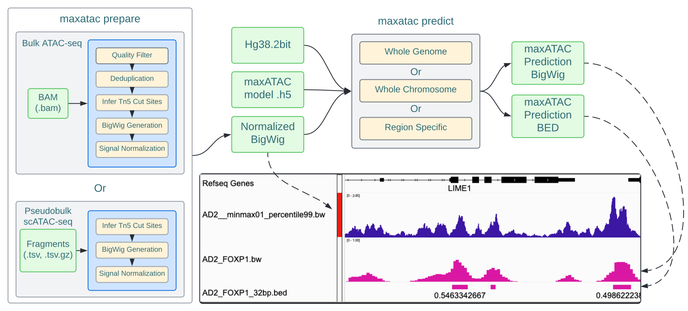

# quant-maxATAC: genome-scale quantitative transcription-factor binding prediction from ATAC-seq with deep neural networks

[](https://pepy.tech/project/maxatac) 

## Introduction

quant-maxATAC is a Python package for **quantitative** transcription factor (TF) binding prediction from ATAC-seq signal and DNA sequence in *human* cell types. Where the original [maxATAC](https://doi.org/10.1371/journal.pcbi.1010863) predicted the *probability* that a TF is bound, quant-maxATAC models are trained to regress the **TF ChIP-seq signal** itself, so predictions reflect binding *strength* rather than a binary bound/unbound call. Predictions are made at 32 bp resolution and work with both population-level (bulk) ATAC-seq and pseudobulk ATAC-seq profiles derived from single-cell (sc)ATAC-seq.

quant-maxATAC requires three inputs:

* DNA sequence, in [`.2bit`](https://genome.ucsc.edu/goldenPath/help/twoBit.html) file format.
* ATAC-seq signal, processed as described [below](#preparing-the-atac-seq-signal).
* Trained quant-maxATAC TF models, in [`.h5`](https://www.tensorflow.org/tutorials/keras/save_and_load) file format.

What changed from maxATAC v1:

* **Model output.** A `softplus` output layer and a regression loss (`mse` by default) replace the sigmoid/cross-entropy head. Training targets are the mean ChIP-seq signal per 32 bp bin (times a user-set `--target_scale_factor`); see [`train`](./docs/readme/train.md).
* **Prediction tracks** are predicted ChIP-seq signal (non-negative, unbounded), not 0–1 probabilities. Binary maxATAC v1 models still run and still output probabilities — the model file decides.
* **Peak calls** are still available: [`threshold`](./docs/readme/threshold.md) calibrates prediction-score thresholds against binary gold standards and writes a `<TF>_cross_celltype.tsv` table that [`predict`](./docs/readme/predict.md) / [`peaks`](./docs/readme/peaks.md) use to pick a cutoff for a target precision, recall or F1.
* **Benchmarking** gained a quantitative mode (`benchmark --quant`) reporting MAE, R², Pearson and Spearman against a quantitative gold standard, alongside the original AUPRC analysis.

> **quant-maxATAC was trained and evaluated on data generated using the hg38 reference genome. The default paths and files that are used for each function will reference hg38 files. If you want to use quant-maxATAC with any other species or reference, you will need to provide the appropriate chromosome sizes file, blacklist, and `.2bit` file specific to your data.**

___

## Installation

It is best to install quant-maxATAC into a dedicated virtual environment.

This version requires python 3.9, `bedtools`, `samtools`, `pigz`, `wget`, `git`, `graphviz`, and `ucsc-bedgraphtobigwig` in order to run all functions.

> The total install data requirements for maxATAC is ~2 GB.

<!-- TODO: `pip install maxatac` installs the binary maxATAC v1 release from PyPI. Replace the git install below with
the PyPI package name/version once quant-maxATAC is published. Same applies to INSTALL.md. -->

### Installing with Conda

1. Create a conda environment for quant-maxATAC with `conda create -n maxatac -c bioconda python=3.9 samtools wget bedtools ucsc-bedgraphtobigwig pigz`

> If you get an error regarding graphviz while training a model, re-install graphviz with `conda install graphviz`

2. Install quant-maxATAC with `pip install git+https://github.com/MiraldiLab/quant-maxATAC.git@quant`

3. Test installation with `maxatac -h`

4. Download reference data with `maxatac data`

> If you have an error related to pybigwig, reference issues: [96](https://github.com/MiraldiLab/maxATAC/issues/96) and [87](https://github.com/MiraldiLab/maxATAC/issues/87#issue-1139117054)

### Installing with python virtualenv

1. Create a virtual environment for quant-maxATAC with `virtualenv -p python3.9 maxatac`.

2. Install required packages and make sure they are on your PATH: samtools, bedtools, bedGraphToBigWig, wget, git, pigz.

3. Install quant-maxATAC with `pip install git+https://github.com/MiraldiLab/quant-maxATAC.git@quant`

4. Test installation with `maxatac -h`

5. Download reference data with `maxatac data`

### Downloading required reference data

In order to run the distributed TF models, the following files are required and installed by [`maxatac data`](./docs/readme/data.md):

* hg38 reference genome `.2bit` file
* hg38 chromosome sizes file
* maxATAC extended blacklist
* TF specific `.h5` model files
* TF specific threshold calibration tables (`<TF>_cross_celltype.tsv`, generated by [`maxatac threshold`](./docs/readme/threshold.md))
* Bash scripts for preparing data

The `maxatac data` function downloads the data repository and reference data into your `~/opt/` directory under `~/opt/maxatac`. Only the hg38 reference genome has been extensively tested.

<!-- TODO: `maxatac data` currently clones https://github.com/MiraldiLab/maxATAC_data (binary v1 models and legacy
threshold files). Point it at the quant-maxATAC model/calibration-table release once available and list the TFs. -->

#### Using custom reference data

The directory `~/opt/maxatac/data` is the default location where quant-maxATAC will look for the models, hg38 reference annotations, etc.

If you want to use your own references (e.g., hg19) or models, set the appropriate flags for each file with the path to your custom files. You can also adjust the relative paths in `constants.py` to be the default values for all functions.

___

## quant-maxATAC Quick Start Overview



>*Schematic: Overview of a typical maxATAC workflow. First, ATAC-seq data is prepared using the `maxatac prepare` function. The prepare function processes bulk and scATAC-seq into normalized signal files. The normalized signal track can then be used to predict TF ChIP-seq signal for the TF of interest. The IGV screenshot shows the maxATAC-normalized ATAC-seq signal (blue) and the predicted FOXP1 track (magenta); predictions are represented as signal tracks (.bw, bigwig) and, after thresholding, as TF binding sites (.bed files), the default outputs from `maxatac predict`.*

### Inputs

* DNA sequence, in [`.2bit`](https://genome.ucsc.edu/goldenPath/help/twoBit.html) file format.
* ATAC-seq signal, processed as described [below](#preparing-the-atac-seq-signal).
* Trained quant-maxATAC TF models, in [`.h5`](https://www.tensorflow.org/tutorials/keras/save_and_load) file format.

### Outputs

* Predicted TF ChIP-seq signal tracks at 32 bp resolution in [`.bw`](https://genome.ucsc.edu/FAQ/FAQformat.html#format6.1) file format. Values are on the (scaled) ChIP-seq signal units the model was trained on, not probabilities.
* [`.bed`](https://genome.ucsc.edu/FAQ/FAQformat.html#format1) file of TF binding sites, obtained by thresholding the prediction track with the model's calibration table at a user-supplied confidence cut off (a target precision, recall, or F1 value; default: the threshold with the maximum F1).

## ATAC-seq Data Requirements

As described in the [maxATAC publication](https://doi.org/10.1371/journal.pcbi.1010863), **maxATAC processing of ATAC-seq signal is critical to prediction**. Key processing steps, summarized in a single command [`maxatac prepare`](./docs/readme/prepare.md#Prepare), include identification of Tn5 cut sites from ATAC-seq fragments, ATAC-seq signal smoothing, filtering with an extended "maxATAC" blacklist, and robust, min-max-like normalization. The ATAC-seq input is prepared identically for quantitative and binary models.

The models were trained on paired-end ATAC-seq data in human. For this reason, we recommend paired-end sequencing with sufficient sequencing depth (e.g., ~20M reads for bulk ATAC-seq). Until these models are benchmarked in other species, we recommend limiting their use to human ATAC-seq datasets.

### Preparing the ATAC-seq signal

The `maxatac predict` function requires a normalized ATAC-seq signal in a bigwig format. Use `maxatac prepare` to generate a normalized signal track from a `.bam` file of aligned reads. See [the prepare documentation](./docs/readme/prepare.md) for more details about the expected outputs and file name descriptions.

#### Bulk ATAC-seq

The function `maxatac prepare` was designed to take an input BAM file that has aligned to the hg38 reference genome. The inputs to `maxatac prepare` are the input bam file, the output directory, and the filename prefix.

```bash
maxatac prepare -i SRX2717911.bam -o ./output -prefix SRX2717911
```

This function took 38 minutes for a sample with 52,657,164 reads in the BAM file. This was tested on a 2019 Macbook Pro with a 2.6 GHz 6-Core Intel Core i7 and 16 GB of memory.

#### Pseudo-bulk scATAC-seq

First, convert the `.tsv.gz` output fragments file from CellRanger into pseudo-bulk specific fragment files. Then, use `maxatac prepare` with each of the fragment files in order to generate a normalized bigwig file for input into `maxatac predict`.

```bash
maxatac prepare -i HighLoading_GM12878.tsv -o ./output -prefix HighLoading_GM12878
```

The prediction parameters and steps are the same for scATAC-seq data after normalization.

## Predicting TF binding from ATAC-seq

Following maxATAC-specific processing of ATAC-seq signal inputs, use the [`maxatac predict`](./docs/readme/predict.md#Predict) function to predict TF ChIP-seq signal with a quant-maxATAC model.

Predictions can be made genome-wide, for a single chromosome, or, alternatively, the user can provide a `.bed` file of genomic intervals for predictions to be made.

### Whole genome prediction

Example command for prediction across the whole genome. If data has been installed with `maxatac data`, `-tf` selects the distributed model for the TF and its threshold calibration table, so a thresholded BED file of binding sites is written alongside the signal track:

```bash
maxatac predict -tf CTCF --signal GM12878_IS_slop20_RP20M_minmax01.bw -n GM12878_CTCF -o outputdir/
```

To request a specific confidence level for the BED output, e.g. an estimated precision of 0.7:

```bash
maxatac predict -tf CTCF --signal GM12878_IS_slop20_RP20M_minmax01.bw -n GM12878_CTCF --cutoff_type Precision --cutoff_value 0.7
```

With your own model file, pass its calibration table with `--cutoff_file`; without one, only the signal track is written (`--skip_call_peaks` also disables peak calling):

```bash
maxatac predict -m CTCF_quant.h5 --cutoff_file CTCF_cross_celltype.tsv --signal GM12878_IS_slop20_RP20M_minmax01.bw -n GM12878_CTCF
```

### Prediction in a specific genomic region(s)

For predictions within specific regions of the genome, a `BED` file of genomic intervals, `roi` (regions of interest) are supplied:

```bash
maxatac predict -tf CTCF --signal GM12878_IS_slop20_RP20M_minmax01.bw -n GM12878_CTCF --roi ROI.bed
```

### Prediction on a specific chromosome(s)

For predictions on a single chromosome or subset of chromosomes, these can be provided using the `--chromosomes` argument:

```bash
maxatac predict -tf CTCF --signal GM12878_IS_slop20_RP20M_minmax01.bw -n GM12878_CTCF --chromosomes chr3 chr5
```

### Calling peaks with a different cutoff

The prediction track can be re-thresholded without re-predicting using [`maxatac peaks`](./docs/readme/peaks.md):

```bash
maxatac peaks -i GM12878_CTCF.bw -cutoff_file CTCF_cross_celltype.tsv -cutoff_type Recall -cutoff_value 0.5
```

## Training a quant-maxATAC model

[`maxatac train --quant`](./docs/readme/train.md) trains a quantitative model from a meta file that pairs, per cell type, a maxATAC-normalized ATAC-seq track with a **quantitative ChIP-seq signal track** (`Binding_File`) plus ATAC-seq and ChIP-seq peak files:

```bash
maxatac train --quant --loss mse --target_scale_factor 1 --sequence hg38.2bit --meta_file CTCF_meta.tsv --output ./CTCF_quant --prefix CTCF_quant --shuffle_cell_type --rev_comp
```

Afterwards, [`maxatac threshold`](./docs/readme/threshold.md) builds the calibration table from validation-cell-type predictions, and [`maxatac benchmark --quant`](./docs/readme/benchmark.md) evaluates the predictions against quantitative gold standards.

## Prediction bigwigs are large

Each whole-genome prediction file is on the order of several hundred MB per TF, and the BED files ~60 MB. Multiply by the number of TF models you run for a single ATAC-seq input track. (Note: it only makes sense to generate predictions for TFs expressed in your cell type / conditions of interest.)

<!-- TODO: replace with measured sizes and the number of distributed quant-maxATAC models. -->

___

## quant-maxATAC functions

| Subcommand                                            | Description                                                                                      |
|-------------------------------------------------------|--------------------------------------------------------------------------------------------------|
| [`data`](./docs/readme/data.md#Data)                  | Download reference data and models                                                               |
| [`prepare`](./docs/readme/prepare.md#Prepare)         | Prepare input ATAC-seq data                                                                      |
| [`average`](./docs/readme/average.md#Average)         | Average bigwig signal tracks (ATAC-seq, ChIP-seq or predictions)                                 |
| [`normalize`](./docs/readme/normalize.md#Normalize)   | Normalize / transform bigwig signal tracks (min-max, z-score, arcsinh, log, sqrt, power)         |
| [`train`](./docs/readme/train.md#Train)               | Train a quantitative (or binary) model                                                           |
| [`threshold`](./docs/readme/threshold.md#Threshold)   | Calibrate prediction-score thresholds and write the `*_cross_celltype.tsv` table                  |
| [`predict`](./docs/readme/predict.md#Predict)         | Predict TF ChIP-seq signal and, optionally, thresholded binding sites                            |
| [`peaks`](./docs/readme/peaks.md#Peaks)               | Call "peaks" on prediction tracks using a calibrated threshold                                   |
| [`benchmark`](./docs/readme/benchmark.md#Benchmark)   | Benchmark predictions against ChIP-seq: AUPRC (binary gold standard) or MAE/R²/Pearson/Spearman (quantitative gold standard) |
| [`variants`](./docs/readme/variants.md#Variants)      | Predict sequence specific TF binding                                                             |

___

## Publication

<!-- TODO: add the quant-maxATAC preprint / paper citation. -->

The original maxATAC manuscript is available on [PLoS Computational Biology](https://journals.plos.org/ploscompbiol/article?id=10.1371/journal.pcbi.1010863).

```pre
Tareian Cazares, Faiz W. Rizvi, Balaji Iyer, Xiaoting Chen, Michael Kotliar, Joseph A. Wayman, Anthony Bejjani, Omer Donmez, Benjamin Wronowski, Sreeja Parameswaran, Leah C. Kottyan, Artem Barski, Matthew T. Weirauch, VB Surya Prasath, Emily R. Miraldi (2023) maxATAC: Genome-scale transcription-factor binding prediction from ATAC-seq with deep neural networks. PLoS Comput Biol 19(1): e1010863. https://doi.org/10.1371/journal.pcbi.1010863
```
