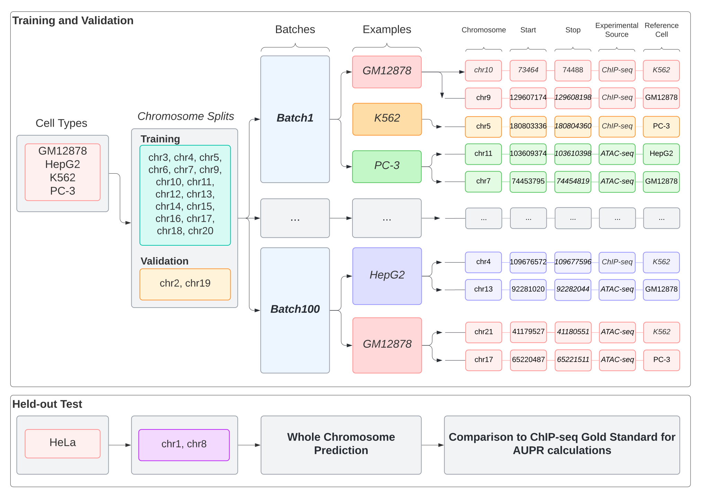

# Train

The `train` function will train a maxATAC model using the supplied ATAC-seq and ChIP-seq inputs. The inputs are organized by a tab-delimited text file described below:

| Column Name        | Description                          |
| ------------------ | ------------------------------------ |
| `Cell_Line`        | Sample Cell Type                     |
| `TF`               | Gene Symbol for TF                   |
| `ATAC_Signal_File` | Path to ATAC-seq bigwig signal track |
| `Binding_File`     | Path to ChIP-seq bigwig signal track |
| `ATAC_Peaks`       | Path to ATAC-seq peak bed file       |
| `CHIP_Peaks`       | Path to ChIP-seq peak bed file       |
| `Train_Test_Label` | Train or Test label                  |

## Approach

The meta file described above is used to locate all the input files for all the training data.

General Steps:

1) Initialize the training regions of interest pools
2) Initialize a `Keras.Sequence` object. Each sequence object is specific for training or prediction. The object will then create random batches of regions of interest from the input ROI pool with the correct ATAC-seq and ChIP-seq signals. 
3) Fit the model for the given # of epochs
4) Select best model based on dice coefficient and save the results of training

### Training, Validation, and Test Data Splits



For each TF model, all the ATAC-seq and ChIP-seq peaks are pooled into training, validation, and test groups.

Each model is trained on 100 batches of 1,000 examples per epoch. Each batch is composed of randomly chosen peaks that are then randomly assigned to cell types.

Training on ATAC-seq and ChIP-seq peaks is considered "peak-centric" training.

Training on multiple cell types per batch that are randomly assigned peaks is called "pan cell" training.

For every TF model, one cell type and 2 chromosomes are held out for independent testing.

## Example

```bash
maxatac train --arch DCNN_V2 --sequence hg38.2bit --meta_file CTCF_meta.tsv --output ./CTCF_DCNN --prefix CTCF_DCNN --shuffle_cell_type --rev_comp
```

## Required Arguments

### `--sequence`

This argument specifies the path to the 2bit DNA sequence for the genome of interest

### `--meta_file`

This argument specifies the path to the meta file that describes the training data available. This meta file described above.

## Optional Arguments

### `--prefix`

This argument is reserved for the prefix used to build the output filename. This can be any string. The extension `.bw` will be added to the filename prefix. Default: `maxatac_model`

### `--train_roi`

This argument is used to input the bed file that you want to use to define the training regions of interest. If you set this option you will randomly select regions from this file for training instead of using the meta data to build the training data pool. 

### `--validate_roi`

This argument is used to input the bed file that you want to use to define the validation regions of interest. If you set this option you will randomly select regions from this file for validation instead of using the meta data to build the validation data pool.

### `--target_scale_factor`

The scaling factor for scaling model targets signal. Used only for quantitative models. Default: `1`


### `--output_activation`

The output activation to use for the model. No other options are considered in the publication. Test at your own risk. Default: `sigmoid`

### `--chroms`

The list of chromosomes to limit the study to. These include the training and validation chromosomes. Default: ```["chr2", "chr3", "chr4", "chr5", "chr6", "chr7", "chr9", "chr10", "chr11", "chr12", "chr13", "chr14", "chr15", "chr16", "chr17", "chr18", "chr19", "chr20", "chr21", "chr22", "chrX"]```

### `--tchroms`

The list of chromosomes to use for training only. Default: ```["chr3", "chr4", "chr5", "chr6", "chr7", "chr9", "chr10", "chr11", "chr12", "chr13", "chr14", "chr15", "chr16", "chr17", "chr18", "chr20", "chr21", "chr22"]```

### `--vchroms`

The list of chromosomes to use for validation only. Default: ```["chr2", "chr19"]```

### `--arch`

The architecture to use for the neural network. Default: `DCNN_V2`

### `--rand_ratio`

The proportion of random regions to use per training and validation batch. This corresponds to the number of regions that are randomly selected form the genome as opposed to being created based on the ATAC-seq or ChIP-seq peaks. Default: `0`

### `--seed`

The seed to use for the model in case of reproducibility. Default: `random.randint(1, 99999)`

### `--weights`

The weights to use to initialize a model. Default: `do not initialize with weights`

### `--epochs`

The number of epochs to train the model for. Default: `20`

### `--batches`

The number of batches to use per stochastic gradient descent step. Default: `100`

### `--batch_size`

The number of examples to use per training batch. Default: `1000`

### `--val_batch_size`

The number of examples to use per validation batch. Default `1000`

### `--output`

The output directory name to save results to. Default: `./training_results`

### `--plot`

Whether to plot the model structure or training history. Default: `True`

### `--dense`

Used if you want to use a dense layer at the end of the neural network. Default: `False`

### `--threads`

Use to change the number of threads used per job. Default: `get available`

### `--loglevel`

This argument is used to set the logging level. Currently, the only working logging level is `ERROR`.

### `--rev_comp_train`

If rev_comp_train, then use the reverse complement sequence in addition to the reference sequence. Default: `False`

### `--shuffle_cell_type`

If shuffle_cell_type, then shuffle training ROI cell type label. This is related to "pan-cell" training as described in the maxATAC manuscript. Default: `True`

