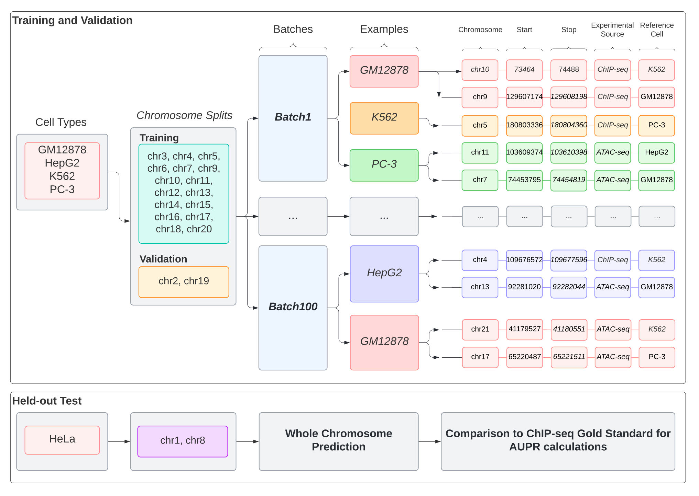

# Train

The `train` function will train a quant-maxATAC model using the supplied ATAC-seq and ChIP-seq inputs. The inputs are organized by a tab-delimited meta file described below:

| Column Name        | Description                                                                                                                                         |
| ------------------ | --------------------------------------------------------------------------------------------------------------------------------------------------- |
| `Cell_Line`        | Sample cell type                                                                                                                                    |
| `TF`               | Gene symbol for TF                                                                                                                                  |
| `ATAC_Signal_File` | Path to the maxATAC-normalized ATAC-seq bigwig signal track (`*_minmax01.bw` from `maxatac prepare`)                                                |
| `Binding_File`     | Path to the ChIP-seq bigwig used as the training target. **`--quant` models:** a quantitative ChIP-seq signal track. **Binary models:** a 0/1 peak track |
| `ATAC_Peaks`       | Path to ATAC-seq peak BED file                                                                                                                      |
| `CHIP_Peaks`       | Path to ChIP-seq peak BED file                                                                                                                      |
| `Train_Test_Label` | `Train` or `Test` label                                                                                                                             |

<!-- TODO: state the ChIP-seq track type/units used for the released quant models (e.g. MACS2 fold-enrichment,
RP20M, `maxatac normalize --method ...`) and the --target_scale_factor they were trained with. -->

**Note: maxATAC was built with version 2.5.0 of tensorflow -- newer versions of tensorflow may not be compatible. Therefore, if you experience errors in running `train`, check the version of tensorflow installed in your environment.**

## Approach

The meta file described above is used to locate all the input files for all the training data.

General Steps:

1) Initialize the training regions of interest pools
2) Initialize a `Keras.Sequence` object. Each sequence object is specific for training or prediction. The object will then create random batches of regions of interest from the input ROI pool with the correct ATAC-seq and ChIP-seq signals.
3) Fit the model for the given # of epochs
4) Select the best epoch and save the results of training

### Quantitative vs. binary targets

Every 1,024 bp training example is split into 32 bins of 32 bp. The per-bin target depends on the model type:

* **`--quant` (quantitative model):** the target is the *mean* ChIP-seq signal of `Binding_File` across the 32 bp, multiplied by `--target_scale_factor`. The model uses a `softplus` output layer and a regression loss (`--loss`, default `mse`). Predictions are therefore on the same (scaled) units as the ChIP-seq targets.
* **Binary model (default):** the target is `1` if more than half of the 32 bp overlap a ChIP-seq peak in `Binding_File`, else `0`. The model uses a `sigmoid` output layer and cross-entropy loss (maxATAC v1 behaviour).

### Model selection

* **`--quant`:** the epoch with the lowest validation loss is found first; among that epoch and later epochs, the one with the smallest `|train_loss - val_loss| / max(train_loss, val_loss)` is selected (guards against over-fit epochs). The training history plot `<prefix>_model_loss_mse_coeff.png` shows loss, R² (`coeff_determination`), Pearson and Spearman correlation per epoch.
* **Binary:** the epoch with the maximum validation dice coefficient is selected, and `<prefix>_model_dice_acc.png` is written.

The path of the selected model is written to `best_epoch.txt` in the output directory.

### Training, Validation, and Test Data Splits



For each TF model, all the ATAC-seq and ChIP-seq peaks are pooled into training, validation, and test groups.

Each model is trained on 100 batches of 1,000 examples per epoch. Each batch is composed of randomly chosen peaks that are then randomly assigned to cell types.

Training on ATAC-seq and ChIP-seq peaks is considered "peak-centric" training.

Training on multiple cell types per batch that are randomly assigned peaks is called "pan cell" training.

For every TF model, one cell type and 2 chromosomes are held out for independent testing.

## Examples

Quantitative model:

```bash
maxatac train --quant --loss mse --target_scale_factor 1 --sequence hg38.2bit --meta_file CTCF_meta.tsv --output ./CTCF_quant --prefix CTCF_quant --shuffle_cell_type --rev_comp
```

Binary (maxATAC v1 style) model:

```bash
maxatac train --arch DCNN_V2 --sequence hg38.2bit --meta_file CTCF_meta.tsv --output ./CTCF_DCNN --prefix CTCF_DCNN --shuffle_cell_type --rev_comp
```

## Required Arguments

### `--meta_file`

This argument specifies the path to the meta file that describes the training data available. This meta file is described above.

## Optional Arguments

### `--quant`

Train a quantitative model (see [Quantitative vs. binary targets](#quantitative-vs-binary-targets)). Without this flag a binary model is trained. Default: `False`

### `--loss`

The loss function. Binary models only support `cross_entropy`. Quantitative models accept one of: `mse`, `pearsonr_mse`, `pearsonr_poisson`, `poisson`, `multinomialnll`, `multinomialnll_mse`, `multinomialnll_mse_reg`, `basenjipearsonr`, `r2`, `multinomialnll_mse_bpnet`, `poissonnll`, `kl_divergence`, `cauchy_lf` (see `maxatac/utilities/losses.py`). Default: `cross_entropy` for binary models, `mse` for `--quant` models. A quantitative loss without `--quant` (or vice versa) is rejected.

### `--output_activation`

The activation function of the output layer (any Keras activation name). Default: `sigmoid` for binary models, `softplus` for `--quant` models. No other options were evaluated for the publication; test at your own risk.

### `--target_scale_factor`

Multiplier applied to the per-bin mean ChIP-seq signal used as the training target (`--quant` models only). Predictions are produced on the same scaled units, so any quantitative gold standard used with [`maxatac benchmark --quant`](./benchmark.md) must be scaled identically. Default: `1`

### `--genome`

Specify which genome build this task is specified for (i.e. hg38). Used to resolve the default `--sequence`, `--blacklist` and `--chrom_sizes`. Default: `hg38`

### `--sequence`

This argument specifies the path to the 2bit DNA sequence for the genome of interest. Default: the `.2bit` file for `--genome` installed by `maxatac data`.

### `--blacklist`

BED file of regions to exclude from the training/validation ROI pools. Default: maxATAC-defined blacklist for `--genome`.

### `--chrom_sizes`

Chromosome sizes file. Default: chromosome sizes for `--genome`.

### `--prefix`

The prefix used to build the output filenames (model `.h5` files, logs and plots). Default: `maxatac_model`

### `--output`

The output directory name to save results to. Default: `./training_results`

### `--train_roi`

This argument is used to input the bed file that you want to use to define the training regions of interest. If you set this option you will randomly select regions from this file for training instead of using the meta data to build the training data pool.

### `--validate_roi`

This argument is used to input the bed file that you want to use to define the validation regions of interest. If you set this option you will randomly select regions from this file for validation instead of using the meta data to build the validation data pool.

### `--chroms`

The list of chromosomes to limit the study to. These include the training and validation chromosomes. Default: ```["chr2", "chr3", "chr4", "chr5", "chr6", "chr7", "chr9", "chr10", "chr11", "chr12", "chr13", "chr14", "chr15", "chr16", "chr17", "chr18", "chr19", "chr20", "chr21", "chr22", "chrX"]```

### `--tchroms`

The list of chromosomes to use for training only. Default: ```["chr3", "chr4", "chr5", "chr6", "chr7", "chr9", "chr10", "chr11", "chr12", "chr13", "chr14", "chr15", "chr16", "chr17", "chr18", "chr20", "chr21", "chr22"]```

### `--vchroms`

The list of chromosomes to use for validation only. Default: ```["chr2", "chr19"]```

### `--arch`

The architecture to use for the neural network. Currently only `DCNN_V2` is supported. Default: `DCNN_V2`

### `--rand_ratio`

The proportion of random regions to use per training and validation batch. This corresponds to the number of regions that are randomly selected from the genome as opposed to being created based on the ATAC-seq or ChIP-seq peaks. Default: `0`

### `--seed`

The seed to use for the model in case of reproducibility. Default: `random.randint(1, 99999)`

### `--weights`

The weights to use to initialize a model. Default: `do not initialize with weights`

### `--epochs`

The number of epochs to train the model for. Default: `100`

### `--batches`

The number of training batches per epoch. Default: `100`

### `--batch_size`

The number of examples to use per training batch. Default: `1000`

### `--val_batch_size`

The number of examples to use per validation batch. Default `1000`

### `--plot`

Whether to plot the model structure and training history. Default: `True`

### `--dense`

Used if you want to use a dense layer at the end of the neural network. Default: `False`

### `--threads`

The number of threads used per job. Default: available CPU count

### `--multiprocessing`

Use multiprocessing workers for the data generators (`tf.keras` `OrderedEnqueuer`). Default: `False`

### `--max_queue_size`

The maximum number of batches queued by the data-generator workers. Default: `2 * --threads`

### `--save_roi`

Write the training and validation ROI pools (and their statistics) to the output directory. Default: `False`

### `--rev_comp`

If set, use the reverse complement sequence in addition to the reference sequence. Default: `False`

### `--shuffle_cell_type`

If shuffle_cell_type, then shuffle training ROI cell type label. This is related to "pan-cell" training as described in the maxATAC manuscript. Default: `True`

### `--loglevel`

Logging level (`fatal`, `error`, `warning`, `info`, `debug`). Default: `info`.
